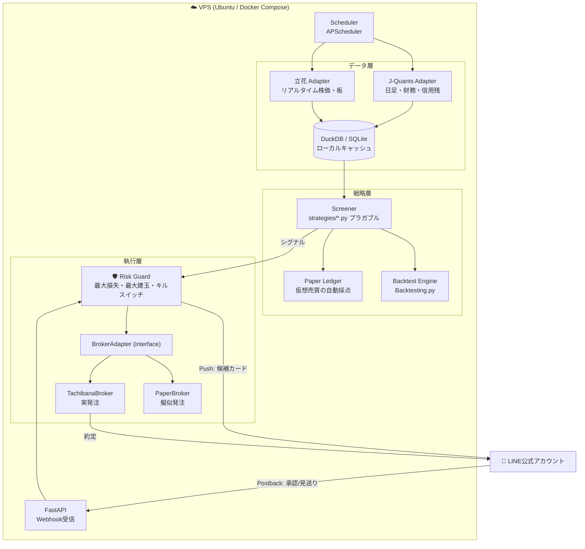
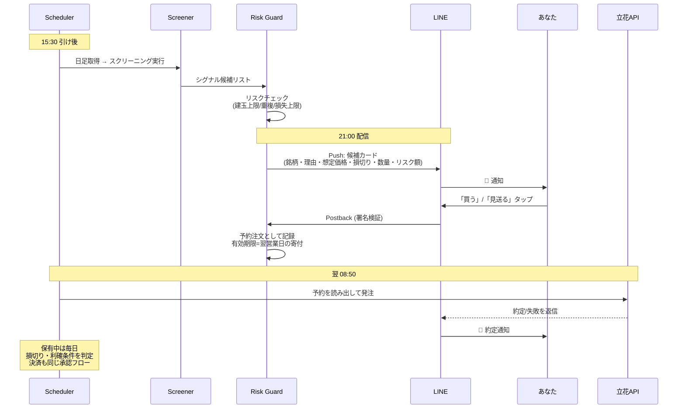

# 設計提案 — LINE承認型・半自動株取引システム

作成日: 2026-08-10
前提: `docs/01_research.md` のリサーチ結果に基づく

---

## 1. ヒアリング結果と前提

### 回答いただいた内容
| 項目 | 回答 |
|---|---|
| 対象市場 | **未定 → おすすめで** |
| 自動化レベル | **LINEで承認したら発注**（承認型半自動） |
| 実行環境 | **クラウドで24時間** |
| 売買スタイル | **未定／複数試したい** |

### 未回答項目の仮置き（いつでも変更可）
| 項目 | 仮置き | 変わると何が変わるか |
|---|---|---|
| 証券口座 | 立花証券e支店を新規開設する前提 | 既に他社口座がある場合、発注APIの選択肢が変わる |
| 月額予算 | 月2,000円程度（VPS約700円＋J-Quants Light 1,650円。当面は無料プランで開始） | AI銘柄コメント機能の有無 |
| 経験レベル | 投資経験あり・コード書けない前提で、コマンドはコピペで完結する形に | 説明の粒度 |
| 運用資金 | 50万〜300万円（単元株で複数銘柄の分散が成立する帯） | ポジションサイジングと対象銘柄の価格帯 |

---

## 2. 推奨構成の結論

### 🇯🇵 **日本株メイン ＋ 立花証券 e支店 API ＋ スイング（数日〜数週間）**

#### なぜ日本株か
「**クラウドで24時間**」と「**LINEで承認したら発注**」の**両方**を満たせる日本株の発注APIは、**立花証券 e支店 API ただ一つ**です。

- **kabuステーションAPI は不可** — Windows専用かつアプリの常時起動が必須、毎営業日AM4〜6時にセッションが切れ、二段階認証で完全自動ログインが困難。クラウド無人運用が構造的に破綻します
- **SBI・楽天は不可** — 個人向けの公開REST APIが存在しません（楽天はWindows専用のExcelアドインのみ）
- **立花証券 e支店 API は適合** — 全通信がHTTPSのGETベース（JSONをURLエンコードして送信）で、**Linux＋Pythonだけで完結**。しかも**口座開設のみで無料**、リアルタイム株価・板・20年分の日足まで取れるので、データ費用も同時に浮きます

#### なぜ米国株を「今は」選ばないか
moomoo OpenAPI ＋ moomoo API Skill（Claude Codeから自然言語で売買）は非常に魅力的ですが、今回の条件とは噛み合いません。

- 米国市場の取引時間は**日本時間 23:30〜翌6:00**。「人間が承認する」半自動モデルとは生活リズムが合いません
- **moomoo OpenAPI は日本株に非対応**（米国株・香港株・中国A株のみ）
- 為替リスクが戦略評価に重畳し、初手の検証が難しくなります

👉 ただし**将来の拡張余地は設計で担保**します。データ層・戦略層・発注層を分離し、`BrokerAdapter` インターフェース越しに発注する構造にしておけば、後から `MoomooBroker` を足すだけで米国株に広げられます。

#### なぜスイング（数日〜数週間）か
「複数試したい」とのことなので、**バックテスト基盤を先に作って比較できる形**にしますが、**デフォルトはスイング**を推します。

- **デイトレは承認型と両立しません** — 場中に人間が承認操作をする前提になり、仕事中は破綻します
- 日足ベースで足り、**通知は1日1回** → LINE無料枠（月200通）に完全に収まります
- 中長期も同じ基盤で回せるので、後から比較検証できます

---

## 3. アーキテクチャ

### 技術スタック
| 層 | 採用 | 理由 |
|---|---|---|
| 言語 | Python 3.12 | 金融ライブラリが揃う。記事群も全てPython |
| Webhook | FastAPI ＋ Uvicorn | LINEのpostback受信。軽量 |
| HTTPS終端 | Caddy | Let's Encrypt証明書を自動取得・自動更新。設定3行 |
| DB | DuckDB（＋SQLite） | 4,400銘柄×20年の日足を単一ファイルで高速集計。サーバー不要 |
| スケジューラ | APScheduler | GitHub Actions cronと違い**実行時刻が正確**（寄り付き前配信に必須） |
| バックテスト | Backtesting.py | 学習コスト最小。日本株の実装例が豊富 |
| 配信 | LINE Messaging API | LINE Notifyは2025/3末で終了済み |
| 実行 | Docker Compose | VPS再構築が一発。環境差異を排除 |

---

## 4. LINE承認型フローの詳細設計

### 通知カードに載せる情報（意思決定に必要な最小セット）
- 銘柄コード・銘柄名・現在値
- **なぜ候補なのか**（どの戦略のどの条件が成立したか）
- 想定エントリー価格 / **損切り価格** / 利確目標
- 提案数量と**必要資金**
- **この取引で失う可能性がある金額（リスク額）** ← これが一番重要
- 直近の値動きチャート（画像 or テキストスパークライン）

### LINE課金の見積もり
- 候補配信 1日1通 × 月20営業日 = **月20通**
- 約定通知・決済シグナルを含めても **月50〜80通程度**
- 無料枠は**月200通** → **月額0円で収まります**
- さらに、こちらから「今日の候補は？」と話しかけて返す形（Reply API）は**課金対象外**なので、実質無制限に問い合わせられます

### セキュリティ
- LINE Webhookの `X-Line-Signature` 署名検証を必須化（これがないと第三者が偽の承認を投げられます）
- 承認可能な LINE user ID を**ホワイトリスト化**
- 立花APIのパスワードは環境変数管理、リポジトリには絶対に置かない
- postbackトークンにワンタイム性を持たせ、リプレイ攻撃を防止

---

## 5. 🛡️ ガードレール（実装必須項目）

「LINEで承認したら発注」は便利な反面、**誤爆すると実際にお金が動きます**。以下をコード側で強制します。

| ガード | 内容 |
|---|---|
| **ドライラン既定** | `LIVE_TRADING=true` を明示しない限り、必ず `PaperBroker`（擬似発注）で動作 |
| 1日の最大発注件数 | 既定3件。バグによる連続発注を物理的に止める |
| 1銘柄あたり上限 | ポートフォリオの◯%まで |
| 同一銘柄の重複禁止 | 既に建玉がある銘柄への追加エントリーをブロック |
| **キルスイッチ** | 1日／累計の損失が閾値に達したら全シグナルを自動停止 |
| 承認の有効期限 | 翌営業日の寄り付きまで。期限切れは自動失効（寝ぼけて承認 → 3日後に約定、を防ぐ） |
| 発注前の最終確認 | 発注直前に価格・数量・資金余力を再検証し、乖離があれば中止してLINE通知 |

---

## 6. 段階計画

| Phase | 内容 | 実発注 | 目安 |
|---|---|---|---|
| **0** | 基盤構築（リポジトリ・Docker・DB・J-Quantsからの日足取得） | なし | 1〜2日 |
| **1** | スクリーニング＋**LINE配信**。毎晩候補が届く状態に | なし | 2〜3日 |
| **2** | **バックテスト＋ペーパートレード自動採点**。「Phase1の通知通り買っていたらどうなったか」を毎日記録 | なし | 3〜4日 |
| **3** | **LINE承認 → PaperBrokerで擬似発注**。UIと承認フローを実弾なしで完成させる | なし | 2〜3日 |
| **4** | 立花API接続 → **少額で実発注**。Phase2の成績が統計的に有意な戦略のみ | **あり** | 口座開設後 |

> **Phase 2 を飛ばさないことが最重要です。** リサーチで判明した通り、個人開発の自動売買が失敗する最大要因は「過剰最適化（バックテストだけ勝てて実弾で負ける）」と「生存者バイアス（上場廃止銘柄を除外したデータで検証してしまう）」です。イン／アウトオブサンプル分割と、上場廃止銘柄を含むデータでの検証を最初から組み込みます。

---

## 7. ⚠️ 立花証券APIに関する注意事項（調査で判明）

| 項目 | 内容 | 対策 |
|---|---|---|
| 口座種別 | **必ず「e支店」で開設**。「ストックハウス」で作るとAPIが使えず、**一度解約しないとe支店側に口座を作れません** | 開設時に最重要チェック項目 |
| セッション | ログインで返る「仮想URL」がセッショントークン。**APIサーバー閉局(03:30)・ログアウト・同一IDの再ログイン**で失効 | 毎朝の自動再ログイン処理を実装。多重起動を禁止 |
| 対象商品 | 国内株式の**現物・信用のみ** | 設計上問題なし |
| 手数料 | 信用取引は取引手数料無料、信用金利1.6%、管理費無料 | — |
| バージョン | 2026/6/27にv4r8廃止済み。**以降はAPIログイン時の電話認証が不要** | 自動化には追い風 |
| 🚨 **パスキー認証** | **2026年12月初旬より取引・出金にパスキー認証の設定が必須**（約4ヶ月後） | **API発注への影響を口座開設時に必ず確認**。最悪の場合、実発注はPhase 4で仕様を再評価。Phase 1〜3（通知・検証）は影響を受けません |

---

## 8. あなたにお願いする準備

| # | 準備 | 費用 | 所要 | 備考 |
|---|---|---|---|---|
| 1 | **J-Quants アカウント** | 無料 | 5分 | まずは無料プランで。Phase 2で Light（1,650円/月）へ |
| 2 | **LINE公式アカウント＋Messaging APIチャネル** | 無料 | 15分 | チャネルアクセストークン／チャネルシークレットを取得 |
| 3 | **VPS**（さくらVPS or ConoHa） | 約700円/月 | 20分 | Ubuntu 24.04、1GBプランで十分 |
| 4 | **立花証券 e支店 口座開設 → API利用申込** | 無料 | 数日〜2週間 | ★「e支店」であることを必ず確認。Phase 4で必要なので今から申請開始を推奨 |

**1〜3だけあれば Phase 1（毎晩LINEに候補が届く）まで到達できます。** 4は口座審査に時間がかかるので、並行して申請だけ進めておくのが効率的です。

---

## 9. 免責・法的整理

- 本システムは**あなた個人が自分の判断で使うためのもの**です。この範囲であれば投資助言・代理業の登録は不要です
- **第三者への販売・貸与・会員制での提供を行う場合は、投資助言・代理業の登録が必要になる可能性が高い**ため、その予定が出てきた時点で必ずご相談ください
- システムが出す候補は「機械的な条件に合致した銘柄」であって、**利益を保証するものではありません**。最終的な投資判断はご自身の責任で行ってください

---

## 10. 次のステップ

この方針でよろしければ **Phase 0＋1 の実装に着手します**（毎晩LINEに候補銘柄が届くところまで）。実発注コードは含まないので、リスクゼロで動くものが手に入ります。

方針を変えたい場合は、特に以下をお知らせください。
- 米国株を主軸にしたい（→ moomoo OpenAPI構成に切り替え）
- すでに証券口座がある（→ 発注APIの選択を見直し）
- デイトレをやりたい（→ 承認型ではなく完全自動 or 場中通知型に設計変更）
